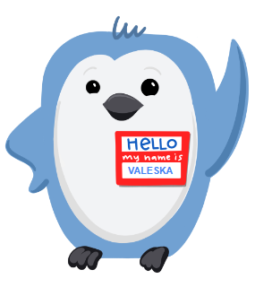

# Portafolio Personal

**Me atraen los problemas que no entregan su respuesta a la primera mirada.**

Las respuestas evidentes rara vez son las más interesantes. Prefiero aquellas que obligan a detenerse, cuestionar lo obvio y mirar una vez más. Es justamente ahí donde comienzan a aparecer los patrones que casi todos pasan por alto.

Por eso elegí la Ciencia de Datos.

No me seduce acumular tecnologías ni coleccionar herramientas. Me interesa comprender qué ocurre detrás de los datos, descubrir las relaciones que permanecen invisibles y transformar información dispersa en conocimiento capaz de cambiar una decisión.

Cada modelo, cada visualización y cada algoritmo son solo un medio. Lo realmente fascinante ocurre cuando una buena pregunta desarma una certeza y revela algo que nadie esperaba encontrar.

Dicen que los datos no mienten. Yo creo que simplemente esperan a que alguien haga la pregunta correcta.