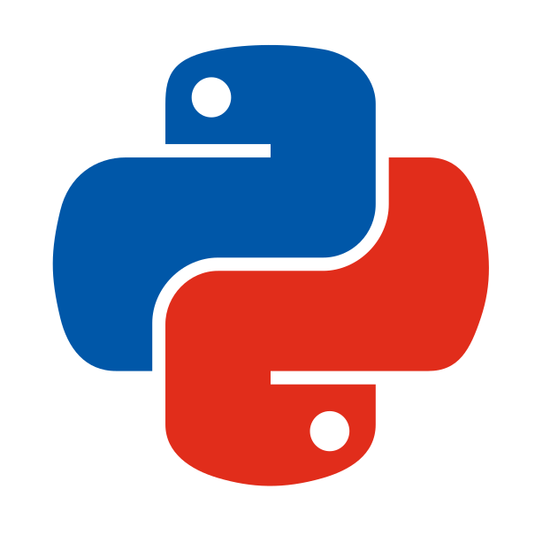

## Más Info

### Reconocimientos

&nbsp <strong>  Inacap </strong>  
&nbsp Valparaíso, 2022  

* Habilidades Tech: Potenciando Mujeres en la Nube – AWS

&nbsp <strong>  Banco de Chile </strong>  
&nbsp Valparaíso, 2022  

* Programa Mujeres Programadoras: Coding Dojo y Banco de Chile.

### Voluntariado

&nbsp <strong> Charlista</strong>  
&nbsp DUOC UC  
&nbsp 2024   

&nbsp <strong> Tallerista</strong>  
&nbsp Python Chile  
&nbsp 2024   

