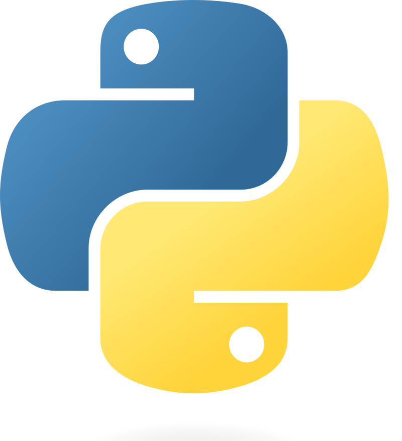
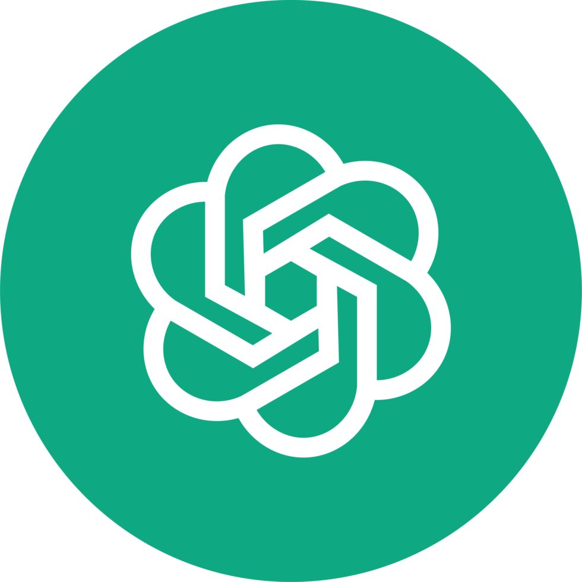
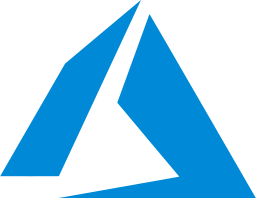
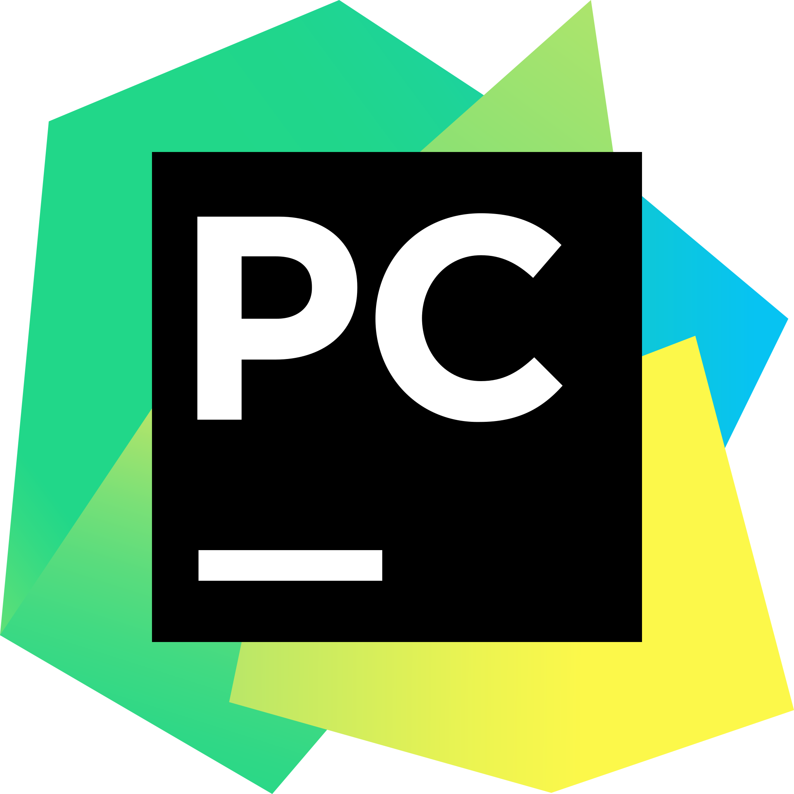

### Educación

&nbsp <strong> Bootcamp</strong>  
&nbsp Desarrollador Full-Stack  
&nbsp Coding Dojo  
&nbsp 2022

&nbsp <strong> Licenciatura</strong>  
&nbsp Ingeniera de Ejecución en Bioprocesos  
&nbsp Pontificia Universidad Católica de Valparaíso  
&nbsp 2009 - 2014

### Certificaciones

  
  
    &nbsp;<strong>AWS Academy Graduate </strong> 
    &nbsp;Online Certifications
  

* AWS Academy Cloud Foundations

  
  
    &nbsp;<strong>DeepLearning.AI </strong> 
    &nbsp;Online Certifications
  

* Machine Learning

  
  
    &nbsp;<strong>Coursera</strong> 
    &nbsp;Online Certifications
  

* Introduction to Data Science in Python

 

### Stack

#### Lenguajes & Frameworks

 
&nbsp;
&nbsp;

#### Cloud

&nbsp;
&nbsp;

#### Herramientas y más

 
&nbsp;
&nbsp;