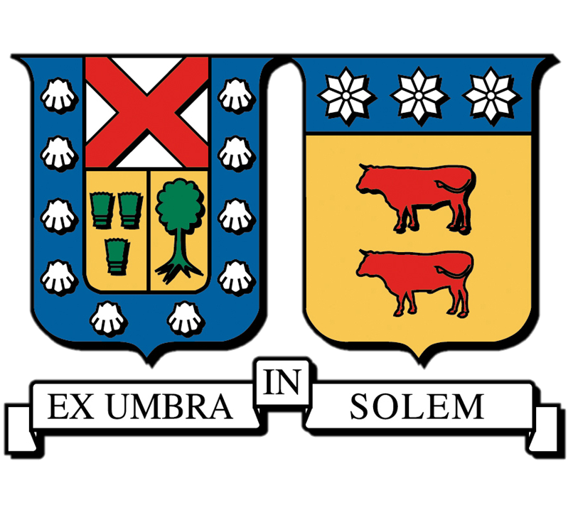
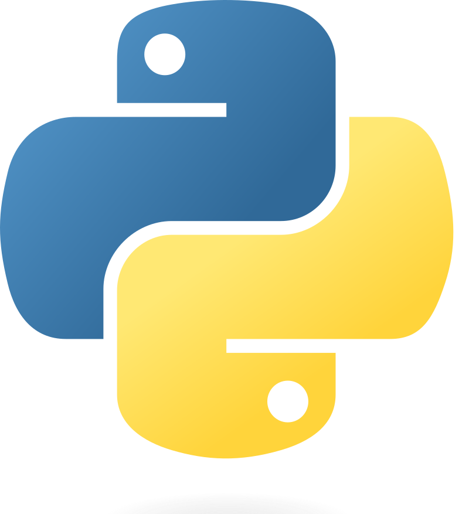
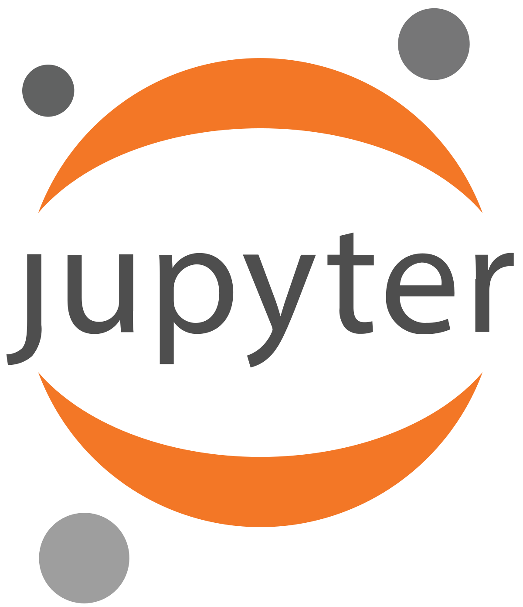
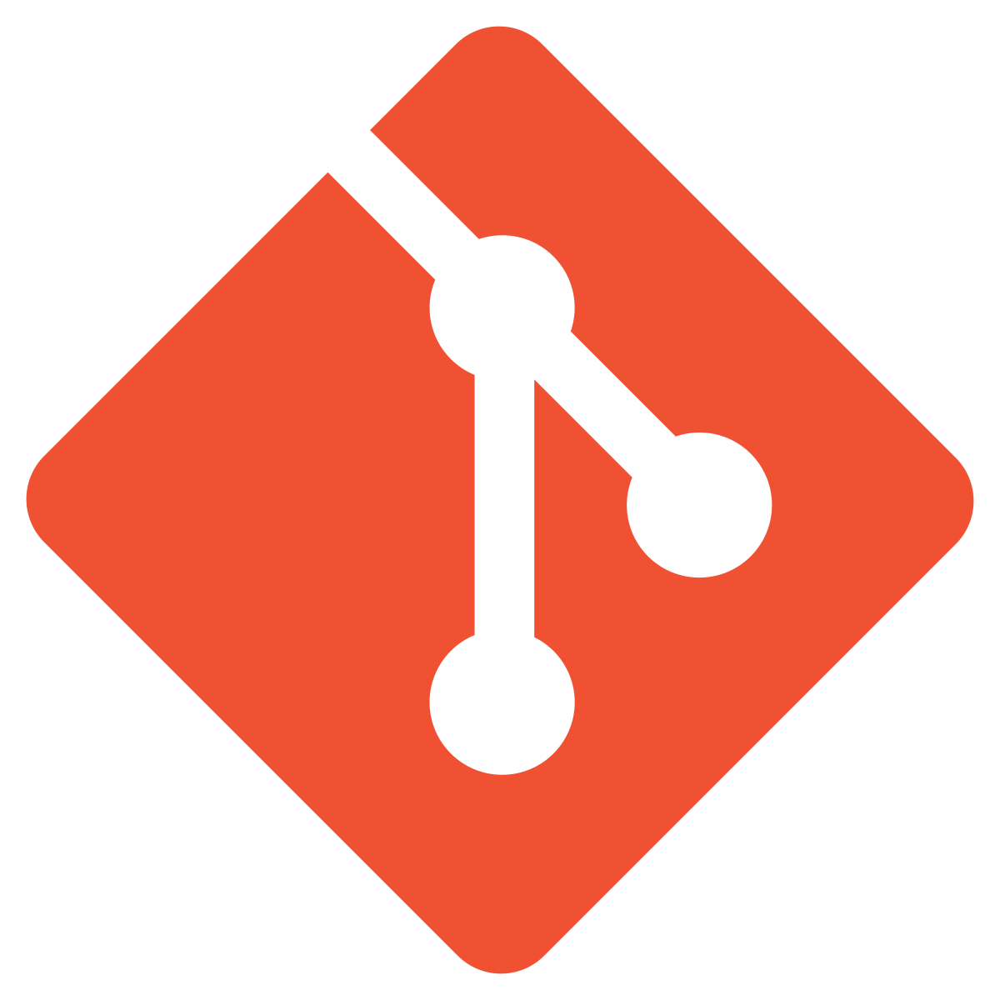
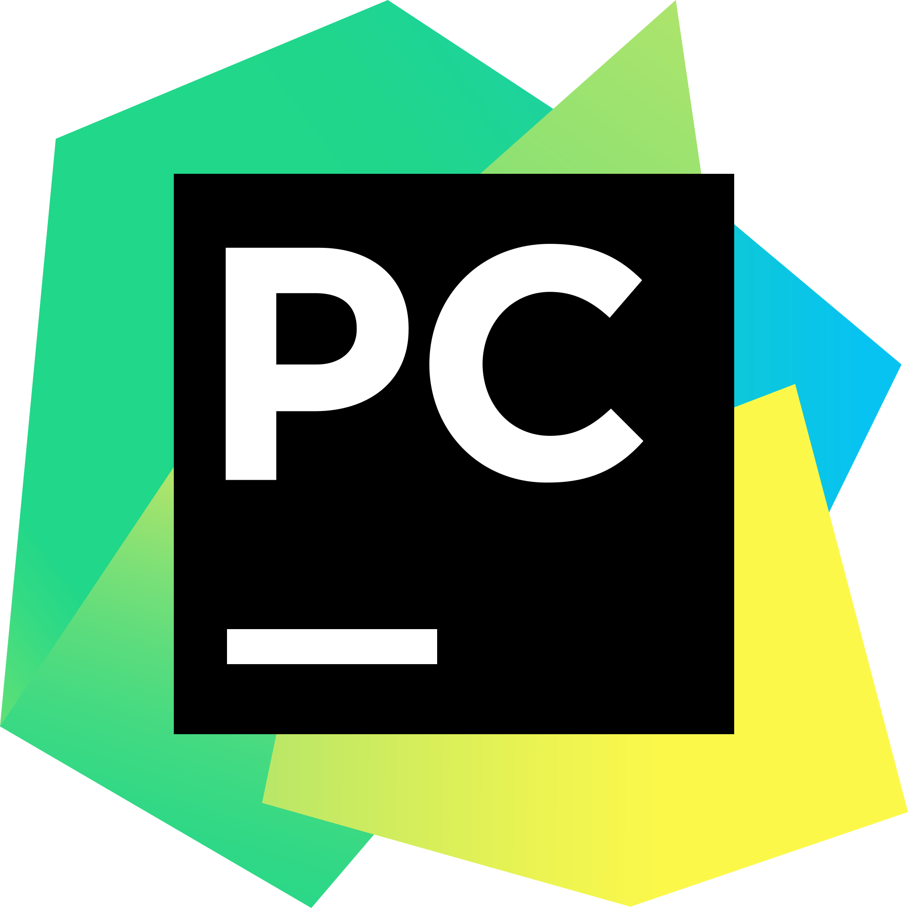
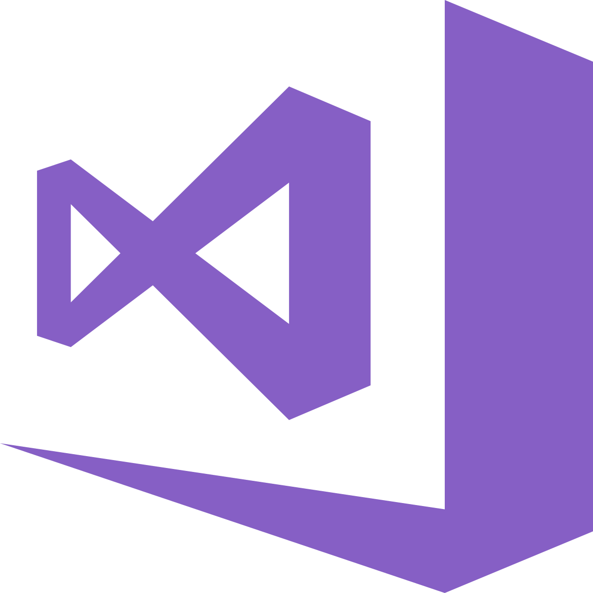

### Educación

<strong>Diplomado</strong> 
Diplomado en Docencia Universitaria 
Universidad Técnica Federico Santa María 
2024 - 2025

<strong>Diplomado</strong> 
Diplomado en Inteligencia Artificial para Educación 
Universidad Técnica Federico Santa María 
2024 - 2025

<strong>Bootcamp - Especialidad Ciencia de Datos</strong> 
Talento Digital + SENCE 
2024 - 2025

<strong>Bootcamp</strong> 
Desarrollador Full-Stack 
Coding Dojo 
2022

<strong>Licenciatura</strong> 
Ingeniera de Ejecución en Bioprocesos 
Pontificia Universidad Católica de Valparaíso 
2009 - 2014

### Certificaciones

<strong>AWS Academy Graduate</strong> 
Online Certifications

* AWS Academy Cloud Foundations

<strong>DeepLearning.AI</strong> 
Online Certifications

* Machine Learning

<strong>Coursera</strong> 
Online Certifications

* Introduction to Data Science in Python

### Stack

#### Lenguajes & Frameworks

#### Cloud

#### Herramientas y más

