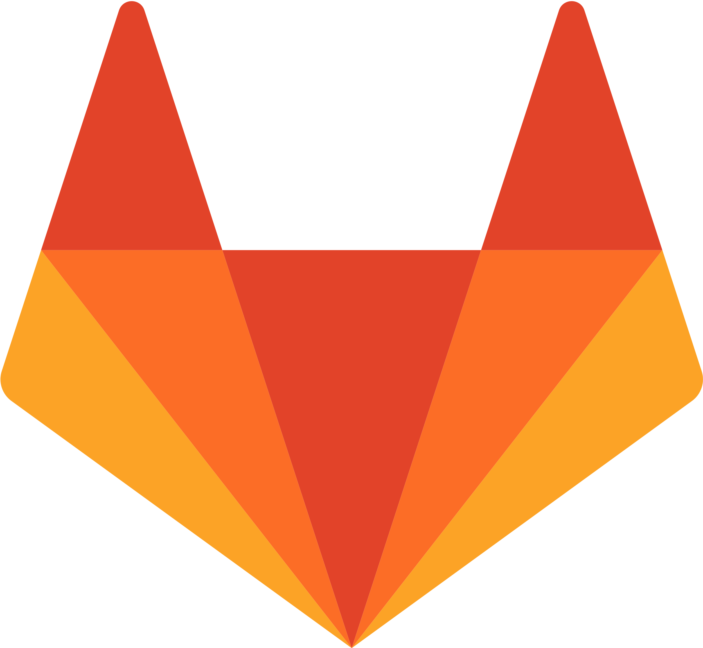

### Acerca de mí

* **Profesión**: 📊 Ingeniera en Bioprocesos
* **Trabajo actual**: 
    * 💻 Fundadora (Seth&Nut)
    * 🗨️ Charlista (DUOC UC)

### Intereses

💪 Deporte | 🍰 Pastelería | 🐶 Perritos

☑️ Educación   
☑️ Visualización   
☑️ Machine Learning   
☑️ Inteligencia Artificial  

### Contact Information

 

 

- **Email**: valeska.canales.p@gmail.com
- **Sitios web**: [Portfolio](https://vcanalesp.github.io/portfolio/)
- **Curriculum Vitae**: [link](https://gitlab.com/vcanalesp/cv)

