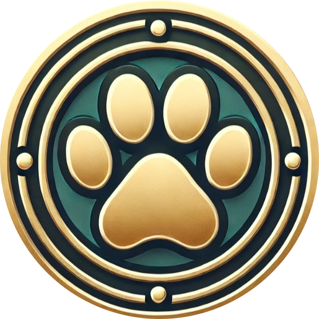
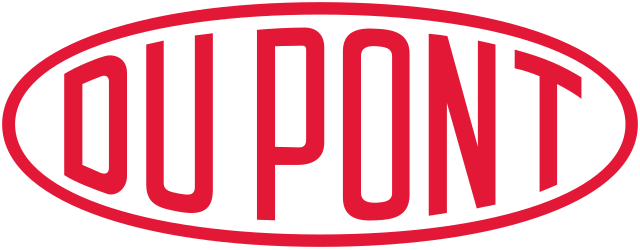

## Experiencia

### Experiencia Laboral

<strong>Científica de Datos</strong> 
Universidad Técnica Federico Santa María 
desde nov. 2025 - Presente

Desarrollo soluciones de Ciencia de Datos e Inteligencia Artificial orientadas a mejorar la toma de decisiones en educación superior. Diseño modelos predictivos y sistemas de alerta temprana utilizando información institucional para identificar riesgos académicos y apoyar intervenciones oportunas.

Participo en todo el ciclo de los proyectos de datos, desde la preparación y análisis de la información hasta el desarrollo de modelos, la visualización de resultados y la comunicación con equipos técnicos y académicos. Asimismo, colaboro en iniciativas de inteligencia artificial, gobernanza y transformación digital para impulsar el uso responsable y estratégico de estas tecnologías.

<strong>Fundadora</strong> 
Seth&Nut 
Oct 2024 – Presente

Somos un equipo apasionado por la enseñanza y la innovación, comprometido con brindar recursos educativos accesibles, de alta calidad y adaptados a todos los niveles de experiencia.

- **Aprendizaje práctico:** Hacemos accesible la programación y las matemáticas para todos.
- **Cursos y talleres:** Ofrecemos formación estructurada y especializada.  
- **Charlas y eventos:** Inspiramos a través de conferencias con expertos.  
- **Material educativo:** Publicamos guías y artículos claros y útiles.  
- **Actividades interactivas:** Fomentamos el aprendizaje dinámico con retos y proyectos.  

<strong>Consultor</strong> 
DataDomz 
Oct 2024 – Presente

Coordino proyectos de consultoría de datos, alineando soluciones tecnológicas con los objetivos del cliente.

* Desarrollo de modelos predictivos de machine learning para mejorar la toma de decisiones basada en datos.
* Creación de dashboards interactivos con Streamlit, facilitando la visualización y análisis de resultados.
* Asesoría en la integración de estrategias de ciencia de datos para optimizar procesos empresariales.

<strong>Consultor</strong> 
Independiente 
Abr 2020 – Sep 2024

Apoyo en la coordinación de proyectos de software, asegurando la correcta ejecución y alineación con los objetivos del cliente:

* Implementación de soluciones avanzadas de machine learning en Google Colab, optimizando modelos para mejorar su precisión y eficiencia.
* Desarrollo y despliegue de aplicaciones interactivas con Streamlit y Streamlit Cloud para la visualización clara y dinámica de resultados de datos.
* Creación e impartición de clases interactivas mediante Pyodide, promoviendo la enseñanza de Python en entornos web de manera accesible y efectiva.

<strong>Pastelera</strong> 
Mercadito Alegre 
Dic 2018 – Mar 2019

Encantar a los clientes con pasteles y postres exquisitos, manteniendo rigurosos estándares de calidad en cada horneado.

<strong>Secretaria</strong> 
Escuela Particular Fray Luis Beltrán 
Sep 2017 – Feb 2018

Gestionar tareas administrativas, coordinar comunicaciones, atender a padres y visitantes, y mantener un entorno organizado en la institución educativa.

<strong>Secretaria Recepcionista</strong> 
Jardín Infantil Snoopy 
Sep 2016 – Feb 2017

Gestionar comunicaciones, coordinar agendas, recibir a padres y visitantes, y asegurar un ambiente acogedor y seguro para los niños.

<strong>Analista de Control de Calidad</strong> 
Dupont 
Nov 2014 – Jun 2015

Implementar y mantener procesos de producción conforme a las normas de calidad ISO 9001, 22000, 19001, 17025, 14001, BRC, HACCP, GMP, RSA, BPL y OHSAS.
 
