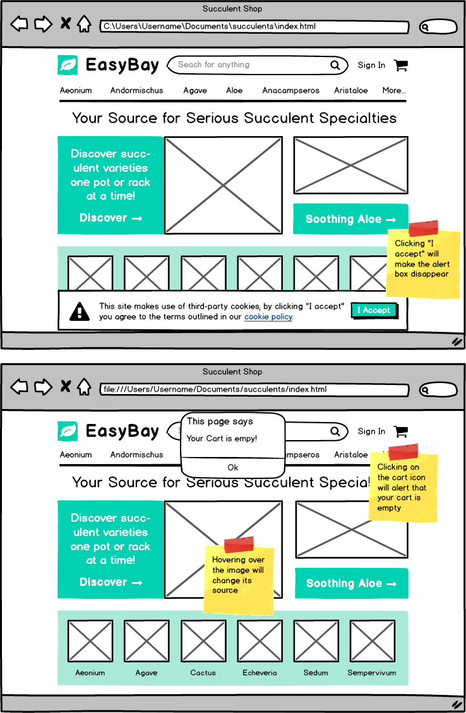

# Option K - EasyBay WF2021

### Requirements:

- Build the above screenshot in HTML/CSS/JS.
- All text should be in HTML format unless it is part of the image. Review the downloadable images to see what text they already provide.
- Buttons/links should be in HTML and not added as images.

Notes:

- The pictures used are available for download [images.zip](https://s3.us-east-1.amazonaws.com/General_V88/boomyeah2015/codingdojo/curriculum/content/chapter/1617143155__images.zip)
- Work on the exercise above and upload your code/files. (Please .zip/compress your exam files before uploading)
- To prevent other students from copying your work, please make sure your code is not saved on GitHub or any file-sharing site.
- To minimize score deduction, please make sure you upload the complete requirements (HTML, CSS, JS, images).
- No need to create video demo for Yellow Belt exam.
- If you are having trouble uploading files on the Exam App, please DO NOT unlock another exam. Please email the file to your instructor.
