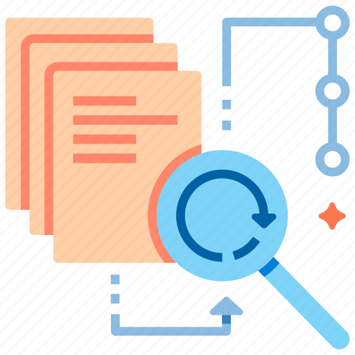

## Proyectos

### [Leyes de Ciberseguridad y Protección de Datos](https://leyes-data-chile.streamlit.app/)

  
  
      &nbsp;🐍 Python 
    &nbsp;🧪 Data Science  
    &nbsp;📅 Oct 01, 2024     
  

El objetivo de este proyecto es presentar, mediante una aplicación interactiva en **Streamlit**, los artículos clave de la **Ley Marco de Ciberseguridad** y la **Ley de Protección de Datos Personales**, junto con resúmenes claros y ejercicios prácticos para que los usuarios puedan aprender de forma dinámica.

* Puedes acceder a la aplicación web interactiva en el siguiente enlace: [Aplicativo](https://leyes-data-chile.streamlit.app/). 
* El código fuente del proyecto está disponible en el repositorio oficial: [GitHub](https://github.com/vcanalesp/st_laws).

### [Telco - Análisis de Churn](https://telcoapp-fd9zbanm736f8egconj6ws.streamlit.app/)

  
  
      &nbsp;🐍 Python 
    &nbsp;🧪 Data Science  
    &nbsp;📅 Jul 15, 2024     
  

El proyecto busca predecir y analizar el churn en clientes de telecomunicaciones. Utilizando **Python**, **Pandas**, **Scikit-learn** y una aplicación interactiva en **Streamlit**, se exploran patrones de comportamiento, desarrollando un modelo predictivo que ofrece insights clave para reducir el abandono y mejorar la retención de clientes.

* Puedes acceder a la aplicación web interactiva en el siguiente enlace: [Aplicativo](https://telcoapp-fd9zbanm736f8egconj6ws.streamlit.app/). 
* El código fuente del proyecto está disponible en el repositorio oficial: [GitHub](https://github.com/vcanalesp/telco_streamlit).

&nbsp;
&nbsp;

### [Recetas](./WebDevelopment/recetas/)

  
  
      &nbsp;🐍 Python 
    &nbsp;🌐 Desarrollo Web  
    &nbsp;📅 Oct 15, 2022     
  

El objetivo de este proyecto es desarrollar una aplicación web dinámica que permita explorar y visualizar una variedad de recetas culinarias. La aplicación estará construida utilizando Flask para el backend, MySQL como base de datos para el almacenamiento de las recetas, y tecnologías frontend como HTML, CSS y JavaScript para ofrecer una experiencia de usuario interactiva y atractiva.

&nbsp;
&nbsp;

### [Página Principal](./WebDevelopment/paginaweb/)

  
  
      &nbsp;🔗 HTML, CSS, JavaScript    
    &nbsp;🌐 Desarrollo Web  
    &nbsp;📅 Ago 25, 2022     
  

El objetivo de este proyecto es desarrollar una aplicación web para crear la página principal de una tienda en línea. Utilizando HTML, CSS y JavaScript, el proyecto se enfocará en ofrecer una interfaz visualmente atractiva, responsiva y fácil de navegar, brindando una experiencia de usuario fluida para explorar productos y servicios.

&nbsp;
&nbsp;

### [Proyectos Ciencia de Datos](https://github.com/vcanalesp/portafolio/tree/main/docs/projects/DataScience)

  
  
      &nbsp;🐍 Python 
    &nbsp;🧪 Data Science  
    &nbsp;📅 Jun 15, 2022     
  

El objetivo de este proyecto es resolver una serie de pequeños proyectos de Ciencia de Datos, abordando distintos problemas mediante el uso de Python y bibliotecas como Pandas, Scikit-learn y Matplotlib.

* [Análisis Exploratorio - Iris](https://github.com/vcanalesp/portafolio/blob/main/docs/projects/DataScience/05_eda/eda.ipynb): Realizar un análisis exploratorio de datos, es decir, distintos tipos de gráficos y tablas sobre el conjunto de datos Iris.
* [Visualización - Seaborn](https://github.com/vcanalesp/portafolio/blob/main/docs/projects/DataScience/04_visualizacion/visualizacion.ipynb): Utilizar herramientas de visualización (como Seaborn) para comprender de mejor manera un problema de manipulación de datos.
* [Índice Libertad Prensa - Pandas](https://github.com/vcanalesp/portafolio/blob/main/docs/projects/DataScience/03_pandas/pandas.ipynb): El objetivo de este proyecto es analizar el conjunto de datos Libertad de Prensa con la librería Pandas.
* [Regresión Líneal - Numpy](https://github.com/vcanalesp/portafolio/blob/main/docs/projects/DataScience/02_numpy/numpy.ipynb): Implementar el modelo de regresión lineal simple utilizando Numpy para resolver un problema de estimación.
* [Ejercicios Básicos con Python](https://github.com/vcanalesp/portafolio/blob/main/docs/projects/DataScience/01_python/python.ipynb): Resolver problemas con Python: nomenclatura, flujo de datos, estructuras de datos, bucles y funciones.

&nbsp;
&nbsp;

